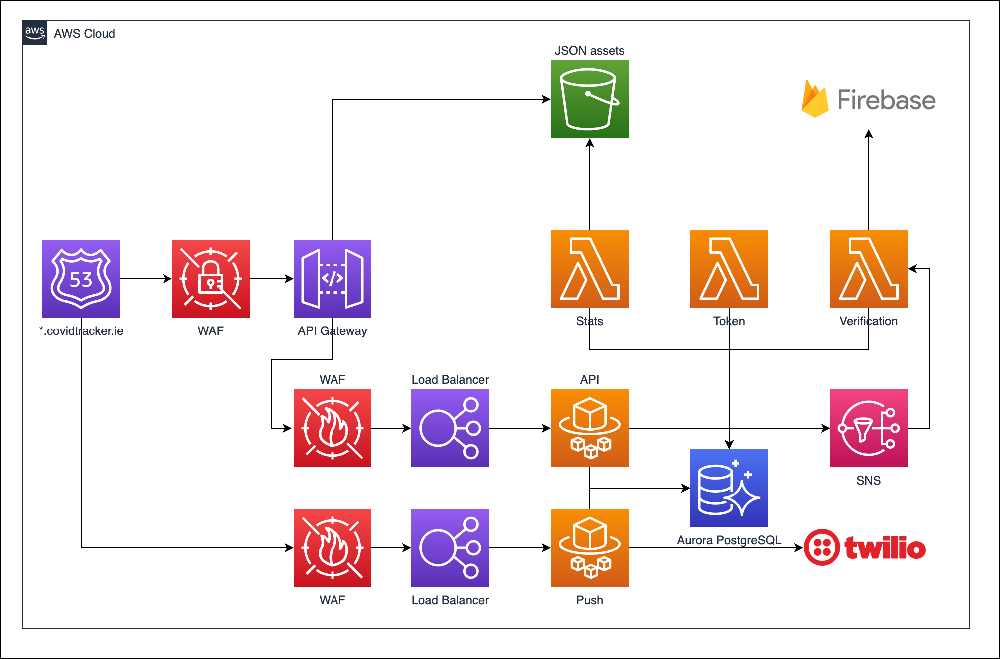
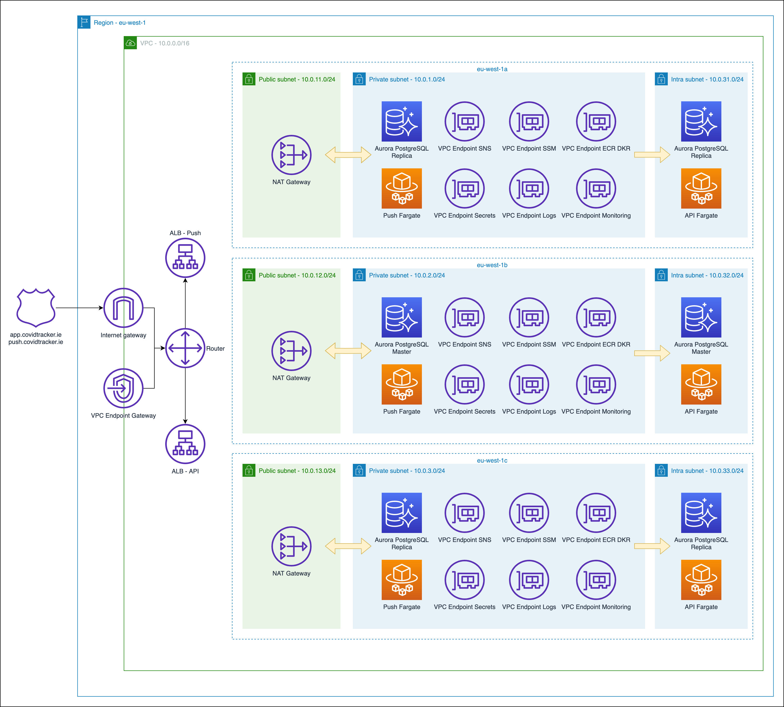

# Terraform

## Diagrams

All diagrams are created using [draw.io](https://draw.io)/[diagrams.net](https://app.diagrams.net/), you can import the XML and modify it.

### Application



### Networking



The network is composed by a main VPC and 3 subnets:

1. `public` for application load balancers and nat gateways
2. `private` for push notification fargate service
3. `intra` for api fargate service

External connectivity via NAT Gateways is allowed just from the `private` subnet. To be able to communicate with AWS services from the `intra` subnet we make use of VPC Endpoints.

The RDS Aurora cluster is avilable to both `private` and `intra` subnets.

## Development

You need first to set up AWS profiles locally for every AWS account/project/environment you're going to work on. Once done change it in the project/environment variables override files in `env-vars`. The project uses 2 different AWS profiles, one to manage the infrastructure and one to manage DNS entries. This is because the AWS account used to spin up an environments could be different from the account from where the DNS zone is registered.
 
See [Creating a new project](./docs/creating-a-new-project.md) for setting up the Terraform backend setup.

Make file usage 
```
# Using the cti project (HSE) and dev environment
make cti-dev-init
make cti-dev-plan
make cti-dev-apply
```

Every `terraform` command can be launched via the `Makefile`, it will take care of initializing the folder to use different backends, planning, applying, and destroying changes.                        

## Lambdas
### authorizer
Checks a JWT is valid when the Gateway tried to access items in the S3 bucket.

### callback
Used to collect symptom info from the app from an SQS queue. Currently unused.

### cso - Optional
This lambda is specific to the Irish app and compiles symptom info into a CSV file. The file is then encrypted using GPG (symmetric key in Secrets) and then uploaded via SFTP to the Central Statistics Office in Ireland.

### exposures
Generates exposure files in zip format for the S3 bucket. Those files contain the encrypted contact tracing information the phone API uses to determine if you have had a close contact with someone. This lambda runs on a schedule, selecting the exposure info from the database and making the archive available once complete.

### notify_slack
For calling Slack web hooks with info.

### stats
This lambda is used to generate a daily stats.json file from a web service run by the Central Statistics Office in Ireland.
This info is used in the Irish app to power various graphs and info screens.

### settings 
This lambda is used to generate a settings.json file which contains values that can override the app defaults.
This saves us having to go through a full App Store release cycle to change minor details like phone numbers etc.

### token
This lambda is used to generate tokens for testing. It is not used by clients or end users. The phone app and backend APIs make use of a service called Device check which validates that we are talking to an actual device. To get around this for testing, we have a lambda that can generate two different kinds of token, one for register and one for push. The register token allows you to bypass the checks in the backend API and the push token works for the push API service.

## AWS secrets and parameters
Secrets are stored in AWS Secrets Manager, these are populated outside of this Terraform content.
- Some are optional as they are not used by all instances

Parameters are stored in AWS System Manager, these are populated by content in this repository
- Some are optional as they are not used by all instances

## Notes

All the infrastructure set up is automated but not secrets that need to be created manually. The current list of secrets used by the app can be found in the `main.tf` file or in the Secrets Manager UI via AWS Console.

## Additional documentation

* [Creating a new project](./docs/creating-a-new-project.md)
* [Project env-vars](./env-vars/README.md)
* [Data disaster recovery plan](./docs/drp-data.md)
* [Monitoring & Logging](./docs/monitoring.md)
* [Bastion access](./docs/bastion.md)
